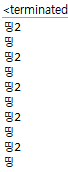

## 스레드(Thread)
- 하나의 프로세스 내부에서 독립적으로 실행되는 하나의 작업 단위, 세부적으로는 운영체제에 의해 관리되는 하나의 작업 또는 테스크  
- 하나의 프로그램이 동시에 여러 개의 일을 수행할 수 있도록 해주는 기법  
- 자바는 언어 차원에서 스레드가 지원 ⇒ 안전성과 효율성 보장  
  
Multi-Threading이 지원되면,  
- 하나의 프로그램 내에서 여러 개의 일을 동시에 수행하는 것이 가능  
- 스레드 간 데이터 공유 가능 → 멀티 프로세스 시스템보다 더 효율적으로 프로그램 작성이 가능!  
  
**<자바의 스레드 지원 방식>**  
1. Java.lang.Thread 클래스 사용  
2. Java.lang.Runnable 인터페이스 사용  
⇒ 차이점  
1 방법: 스레드를 지원하고자 하는 클래스를 생성 시 즉  Thread를 상속받는 class를 start 시킨다.  
2 방법: Runnable를 구현한 class를 new Thread()의 인수로 주어서 새로 만든 다른 클래스로부터 상속이 필요한 경우 Thread객체를 start() 시키는 것  
  
**<Thread 클래스 사용법>** 
1. Thread 클래스를 상속 받은 뒤, 해당 클래스에서 지원하고 싶은 코드를 run()  메소드에서 오버라이딩 한다.  
2. 해당 스레드 객체를 생성한 후, 스레드 객체의 start() 메서드를 호출한다.  
  
**<Runnable 인터페이스의 사용법>**  
1. Runnable 인터페이스를 구현한 스레드 클래스를 정의하고, 해당 스레드에서 지원하고 싶은 코드를 run() 메소드에서 오버라이딩해준다.  
2. 해당 클래스 객체를 생성한 후, Thread 클래스 생성자의 인자로 넘겨서 Thread를 생성하고, 이 Thread 클래스 객체의 start() 메소드를 호출한다.  

**<start() 메소드와 run() 메소드의 관계>**  
- 프로그래머는 스레드의 start() 메소드만을 호출할 수 있다.  
- 그러면, JVM이 스레드를 준비(ready)상태로 바꾼다.  
- 준비 상태의 JVM 내의 스레드 스케줄러가 실행(run)상태로 바꾸어주면, 이 때 비로소 스레드의 run() 메소드가 실행 된다.  

**<동기화>**
- 자바에서는 언어 차원에서 멀티스레딩을 지원한다.  
- 여러 개의 스레드가 같은 데이터나 메소드를 사용할 때 주의해야할 점이 있는데, 바로 동기화를 맞추는 것이다.  
  
  

----------------------------------------------------------------------------------------------------------------------------------------------------------------

### [실습: 스레드 구현]

프로젝트 명: 1006_스레드구현  
패키지 명: 멀티스레드예제  
클래스 명:  BeepPrintEx01 ⇒ main() 포함 O  
	   BeepPrintTask ⇒ main() 포함 X  
           BeepPrintEx02 ⇒ main() 포함 O  
  
```java
/import java.awt.Toolkit;

/*
 * 싱글 스레드(즉, 메인 스레드) 애플리케이션
 */
public class BeepPrintEx01 {

	public static void main(String[] args) {
		//Toolkit객체 얻어오기
		//Toolkit클래스는 '시스템 정보'를 얻는 것으로 시스템의 자원에 접근할 수 있는 클래스
		Toolkit toolkit= Toolkit.getDefaultToolkit();
		
		for(int i=0;i<5;i++) {
			toolkit.beep(); //5초에 한번씩 beep(경보) 발생
			try {
				Thread.sleep(1000); //1초간 cpu를 잠시 일시 정지
			}catch (Exception e) {
				
			}
		}
		
		
		for(int i=0;i<5;i++) {
			System.out.println("띵"); //5초에 한번씩 띵(경보) 발생=> 5초가 다 지난다음에 출력 => 싱글 스레드
			try {
				Thread.sleep(1000); //1초간 cpu를 잠시 일시 정지
			}catch (Exception e) {
				
			}
		}
		
	}

}
```
  
```java
import java.awt.Toolkit;

/*
 * BeepTask 구현 클래스 => '작업스레드' 역할
 */

public class BeepPrintTask implements Runnable {

	@Override
	public void run() { //재정의
		Toolkit toolkit= Toolkit.getDefaultToolkit();
		
		for(int i=0;i<5;i++) {
			System.out.println("띵");
			toolkit.beep(); //5초에 한번씩 beep(경보) 발생
			try {
				Thread.sleep(1000); //1초간 cpu를 잠시 일시 정지
			}catch (Exception e) {
				
			}
		}
		
	}

}
```
  
```java
public class BeepPrintEx02 {
	
	/*
	 * 메인 스레드
	 */

	public static void main(String[] args) {
		// 작업스레드 만드는 방법
		Runnable beepTask= new BeepPrintTask();
		Thread thread= new Thread(beepTask);
		
		thread.start(); //이 시점에서 작업 스레드와 메인 스레드가 동시에  실행!!

		for(int i=0;i<5;i++) {
			System.out.println("띵2"); //메인스레드에서   띵2를 1초에 한번 실행
			try {
				Thread.sleep(1000); //1초간 cpu를 잠시 일시 정지
			}catch (Exception e) {
				
			}
		}
	}

}
```
  
  
  
ex) 채팅 프로그램, 게임 프로그램 구현 시 멀티스레드를 적극 활용한다.  
  
-----------------------------------------------------------------------------------------------------------------------------------------------------------
  
   
### 실습2
  
패키지 명: 가상의로봇릴레이게임  
클래스 명: RobotRaceStart ⇒ main() 포함 O  
  
```java
class RobotRace extends Thread{
	//생성자
	public RobotRace(String name) {
		super(name);
	}

	@Override
	public void run() {
		//가상 로봇 100m 릴레이 => 10m씩 전진
		for(int i=0;i<11;i++) {
			System.out.println(getName()+"가"+i*10+"m 전진");
			try {
				sleep(1000); //1초 일시정지
			} catch (InterruptedException e) {
				System.out.println(e.toString());
			}
		}
	}

}
```
   
```java
public class RobotRaceStart {

	public static void main(String[] args) {
		RobotRace robotA= new RobotRace("로봇A");
		RobotRace robotB= new RobotRace("로봇B");
		RobotRace robotC= new RobotRace("로봇C");
		
		robotA.start();
		robotB.start();
		robotC.start();

	}

}
```
