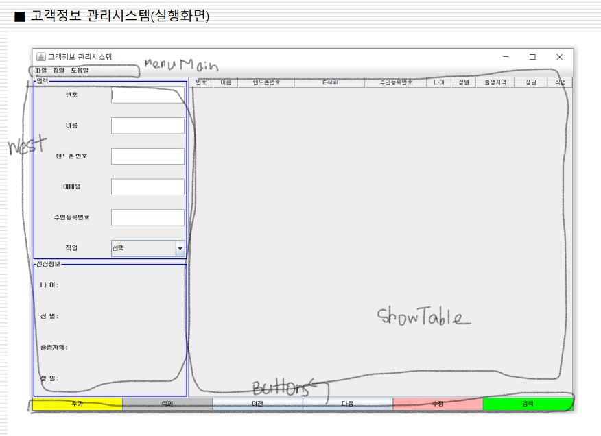

자바 종합 프로젝트 ⇒ 윈도우 프로그램(GUI)  
  
프로젝트 명: 고객정보 관리 시스템  
패키지 명: 고객관리구축  
클래스 명: ManageSystem ⇒ main() 포함   

  

  
   
    
  
## 팝업 다이얼로그  
사용자에게 메세지를 전달하거나 문자열을 간단히 입력받는 용도  
- JOptionPane 클래스를 이용하여 생성  
= static 타입의 간단한 메서드 이용  

**입력 다이얼로그** 
- JOptionPane.showInputDialog()  
- 한 줄을 입력 받는 다이얼로그   
  
static String JOptionPane.showInputDialog(String msg)   
* msg : 다이얼로그 메시지   
* 리턴 값 : 사용자가 입력한 문자열, 취소 버튼이 선택되거나 창이 닫히면 null 리턴

  
  
**확인 다이얼로그** 
- JOptionPane.showConfirmDialog() 
- 사용자로부터 Yes/No 응답을 입력 받는 다이얼로그

**메시지 다이얼로그**
- JOptionPane.showMessageDialog() 
- 단순 메시지를 출력하는 다이얼로그

