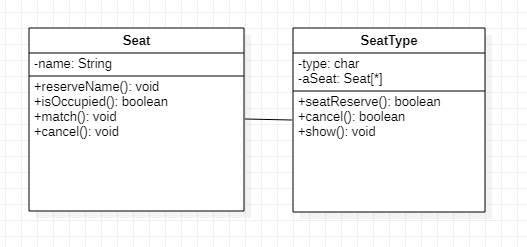

# 실습문제 2회

간단한 공연 예약 시스템을 만들어보자. 세 개의 클래스를 생성한다.  

(1) Seat 클래스 → 좌석 클래스 (라이브러리 클래스)  
(2) SeatType 클래스 → 좌석타입 클래스 (라이브러리 클래스)  
(3) Reserve 클래스 → 예약 클래스 (실행 클래스)  

<시나리오> 공연 시스템의 내용은 다음과 같다.  
  
- 공연은 하루에 한번 있다.
- 좌석은 R석(5석), S석(7석), A석(10석), B석(15) 타입이 있다.  
⇒ 참고: R석(Royal석), S석(Superior석), A석(A grade), B석(B grade)
- 공연 예약 시스템의 메뉴는 "예약", "조회", "취소", "종료"가 있다.
- "예약"은 한 자리만 예약할 수 있고 좌석 타입, 예약자 이름, 좌석 번호를 순서대로 입력 받아 예약한다.
- "조회"는 모든 종류의 좌석을 표시한다.
- "취소"는 예약자 이름을 입력하여 취소한다.
- 없는 예약자 이름, 없는 좌석번호, 없는 메뉴, 예약 또는 취소시 없는 좌석 타입 등에 대해서 오류 메시지를 출력하고 사용자가 다시 시도하도록 한다.  
예) "예약자 이름을 찾을 수 없습니다."  
   "잘못된 좌석번호입니다."  
   "메뉴를 잘못 입력하셨습니다."  
   "예약시 잘못된 좌석타입입니다."  
   "취소시 잘못된 좌석타입입니다."  
   

--------------------------------------------------------------------------------------------------------------------------------------------------  
  
    
## 문제해결 순서  
(1) 클래스 다이어그램 작성  
(2) 구현(코딩)  
⇒ 공연 예약 애플리케이션은 연관 관계  
  
* 관계  
관계 — 연관 관계 ——— 일반화 관계 

      ㅣ                   ㅣ

      ㅣ                     ——— 특수(특별) 관계  ———— 집합 관계 

      ㅣ                                                           ㅣ 

      ㅣ                                                            ———— 복합 관계

        — 의존 관계
          
  
(1) 클래스 다이어그램 작성  
  
클래스 명: Seat ⇒ main() 포함 X  
          SeatType ⇒ main() 포함 X  
          ReserveTest ⇒ main() 포함 O  
