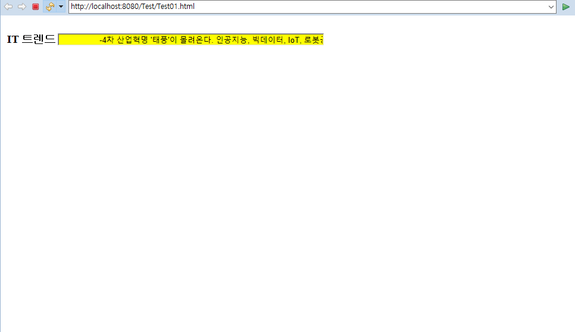
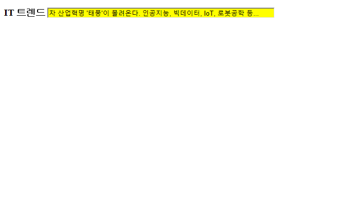

**[실습 1] "문자열" 흘러가기 효과 주기**

1. Test01.html 파일 생성  

```java
<!DOCTYPE html>
<html>
<head>
<meta charset="UTF-8">
<title>Insert title here</title>
<script>
	//JS code
	var msg= "-4차 산업혁명 '태풍'이 몰려온다. 인공지능, 빅데이터, IoT, 로봇공학 등..."
	
	//문자열 앞에 공백 넣기
	for(i=0; i<60; i++){
		msg=" "+msg
	}
	
	function scrollTrend(){
		document.myForm.trend.value= msg.substring(0,59)
		msg= msg.substring(1, msg.length)+ msg.substring(0,1) //공백 하나씩 앞에서 뒤로 옮기기!
		clearTime= setTimeout("scrollTrend()",100) //100만큼의 시간대기 후 scrollTrend() 재호출
	}
	
	function scrollStop(){
		clearTimeout(clearTime) //설정했던 타이머 제거!
	}
</script>
</head>
<body onload="scrollTrend()"> <!-- 이벤트 핸들러 : 해당 파일이 load될 때 실행-->
	<form name="myForm">
		<table>
			<tr>
				<td><h3>IT 트렌드</h3></td>
				<td><input type="text" name="trend" size="70" 
				style="background-color: yellow"
				onmouseover="scrollStop()" onmouseout="scrollTrend()" /></td>
				<!-- 마우스를 올리면 멈추고, 나가면 다시 재시작 -->
			</tr>
		</table>
	</form>
</body>
</html>
```
  
실행 결과 ⇒ 동적인 텍스트 : 글자가 오른쪽에서 왼쪽으로 움직인다.  

  

