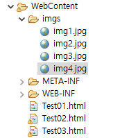

**[실습 3] 1초마다 이미지 변경하기**   
1. WebContent 아래에 imgs 폴더를 생성한 후 네 장의 사진을 넣는다.  

2. Test03.html 파일을 생성  

```java
<!DOCTYPE html>
<html>
<head>
<meta charset="UTF-8">
<title>Insert title here</title>
<script>
	var imgs= new Array() //배열객체 생성
	
	imgs.push("./imgs/img1.jpg")
	imgs.push("./imgs/img2.jpg")
	imgs.push("./imgs/img3.jpg")
	imgs.push("./imgs/img4.jpg")
	
	window.onload= function(){ //콜백 함수
		setInterval("imageChange()", 1000) //1초마다 imageChange() 함수를 호출
	}
	
	function imageChange(){
		var currentDate= new Date()
		var img= document.getElementById("img")
		img.src= imgs[currentDate.getSeconds()%4]
	}
</script>
</head>
<body>
	<center>
		<h1>(주)휴먼 소프트웨어 이미지 동적 교체</h1>
		
	</center>
</body>
</html>
```
   
**⇒ 2초에 한번씩 이미지 변경하기**  
  
첫 번째 해결 방법))   

```java
<!DOCTYPE html>
<html>
<head>
<meta charset="UTF-8">
<title>Insert title here</title>
<script>
	var imgs= new Array() //배열객체 생성
	
	imgs.push("./imgs/img1.jpg")
	imgs.push("./imgs/img2.jpg")
	imgs.push("./imgs/img3.jpg")
	imgs.push("./imgs/img4.jpg")
	
	//[문제] 사용자 요구사항이 있다고 가정하면 => 2초마다 이미지를 교체해달라(수정)
	
	window.onload= function(){
		setInterval("imageChange()", 2000) //2초마다 imageChange() 함수를 호출 **변경
	}
	
	function imageChange(){
		var currentDate= new Date()
		var img= document.getElementById("img")
		img.src= imgs[Math.ceil(currentDate.getSeconds()/2)%4] //**변경
	}
</script>
</head>
<body>
	<center>
		<h1>(주)휴먼 소프트웨어 이미지 동적 교체</h1>
		
	</center>
</body>
</html>
```
  
두 번째 해결 방법))  

```java
<!DOCTYPE html>
<html>
<head>
<meta charset="UTF-8">
<title>Insert title here</title>
<script>
	var imgs= new Array() //배열객체 생성
	
	//추가[두번째 해결책]
	var index=0
	
	imgs.push("./imgs/img1.jpg")
	imgs.push("./imgs/img2.jpg")
	imgs.push("./imgs/img3.jpg")
	imgs.push("./imgs/img4.jpg")
	
	//[문제] 사용자 요구사항이 있다고 가정하면 => 2초마다 이미지를 교체해달라(수정)
	
	window.onload= function(){
		setInterval("imageChange()", 2000) //1초마다 imageChange() 함수를 호출
	}
	
	function imageChange(){
		//[두번째 해결책] => 소스 가독성이 좋다!
		var img= document.getElementById("img")
		img.src= imgs[index]
		index++
		
		if(index==imgs.length) index=0
	}
</script>
</head>
<body>
	<center>
		<h1>(주)휴먼 소프트웨어 이미지 동적 교체</h1>
		
	</center>
</body>
</html>
```
  
**⇒ 이미지 텍스트 표시하기**  
  
```java
<!DOCTYPE html>
<html>
<head>
<meta charset="UTF-8">
<title>Insert title here</title>
<style>
	#img { width: 400px; height: 200px; }
</style>
<script>
	var imgs= new Array() //배열객체 생성
	
	//추가[두번째 해결책]
	var index=0
	
	imgs.push("./imgs/img1.jpg")
	imgs.push("./imgs/img2.jpg")
	imgs.push("./imgs/img3.jpg")
	imgs.push("./imgs/img4.jpg")
	
	var imageText= new Array()
	imageText.push("이미지 텍스트1");
	imageText.push("이미지 텍스트2");
	imageText.push("이미지 텍스트3");
	imageText.push("이미지 텍스트4");
	
	
	//[문제] 사용자 요구사항이 있다고 가정하면 => 2초마다 이미지를 교체해달라(수정)
	
	window.onload= function(){
		setInterval("imageChange()", 2000) //1초마다 imageChange() 함수를 호출
		
	}
	
	function imageChange(){
		/*[첫번째 해결책]
		var currentDate= new Date()
		var img= document.getElementById("img")
		img.src= imgs[Math.ceil(currentDate.getSeconds()/2)%4]
		*/
		
		//[두번째 해결책]
		var img= document.getElementById("img")
		var text= document.getElementById("text")
		//textContent 속성은 입력한 텍스트가 body 태그에 바로 들어간다!
		//textContent는 innerHTML과 비슷하지만 태그를 문자로 인식하여 가져온다.
		text.textContent= imageText[index]
		img.src= imgs[index]
		index++
		
		if(index==imgs.length) index=0
	}
</script>
</head>
<body>
	<center>
		<h1>(주)휴먼 소프트웨어 이미지 동적 교체</h1>
		
		<h3 id="text"></h3>
	</center>
</body>
</html>
```
  
