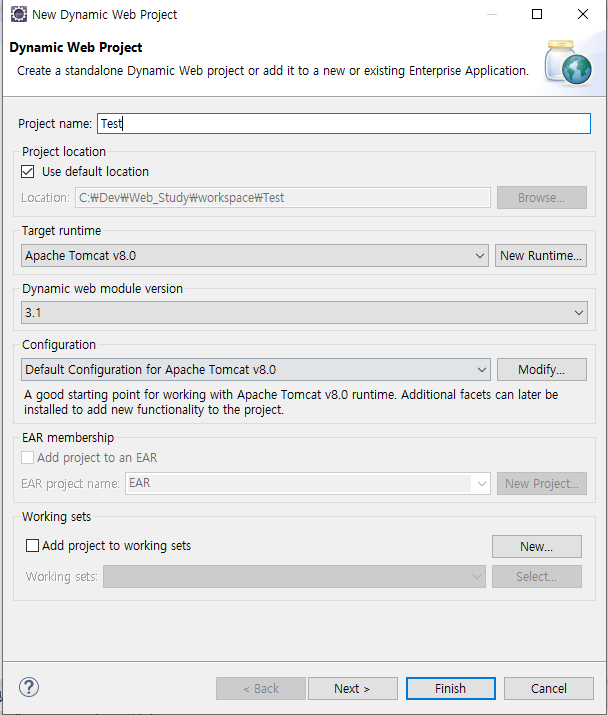
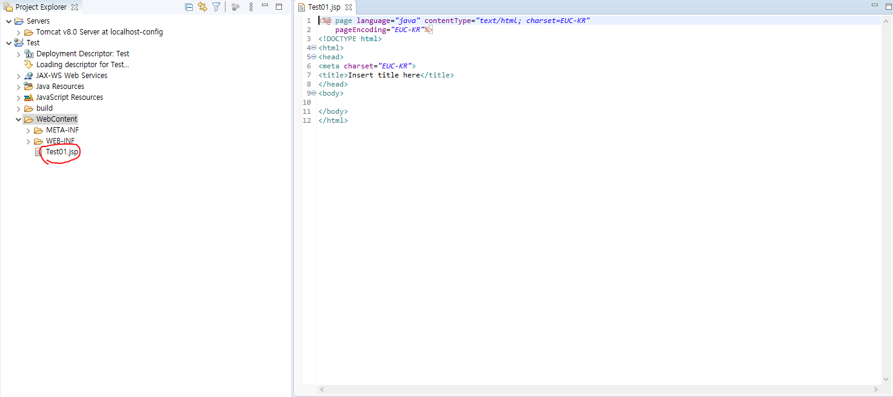
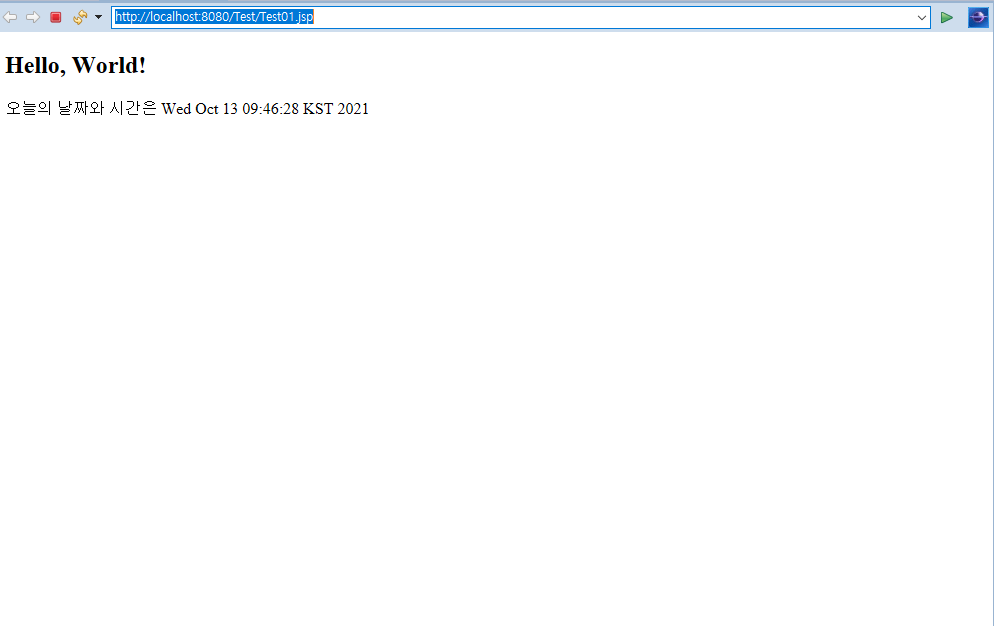

### 프로젝트 생성 

1. File→ new → dynamic web project → 'Test'로 이름 설정하여 생성  
  
  
2. WebContent 내부에 JSP파일 생성해보기 (Test01.jsp)  
  
  
```java
<%@ page language="java" contentType="text/html; charset=UTF-8"
    pageEncoding="UTF-8"%>
<!DOCTYPE html>
<html>
<head>
<meta charset="UTF-8">
<title>Insert title here</title>
</head>
<body>
	<h2>Hello, World!</h2>
	오늘의 날짜와 시간은 <%=new java.util.Date() %>
</body>
</html>
```
  
실행 결과  


