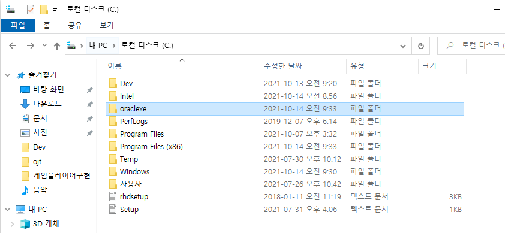
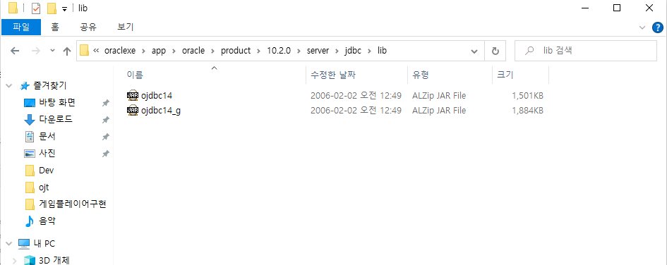
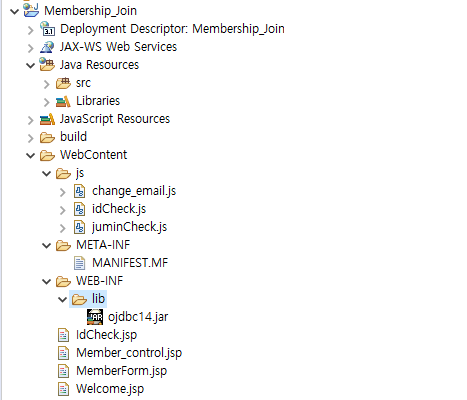
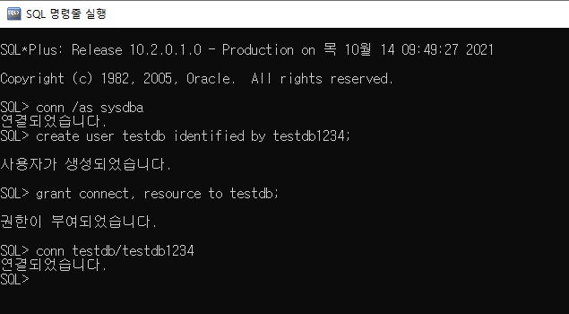
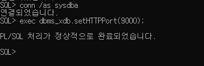
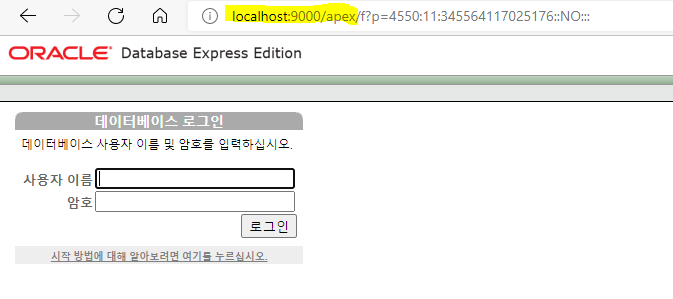
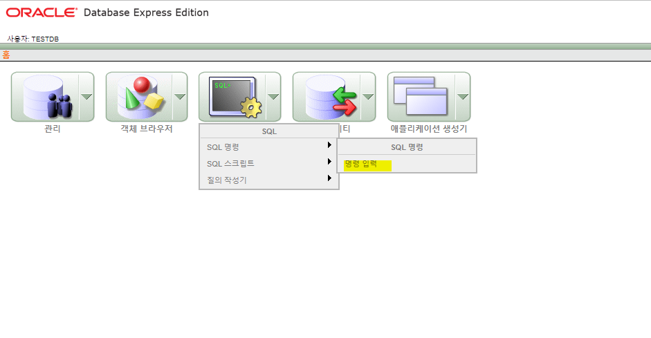
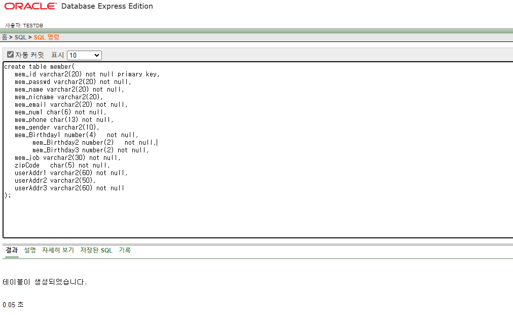
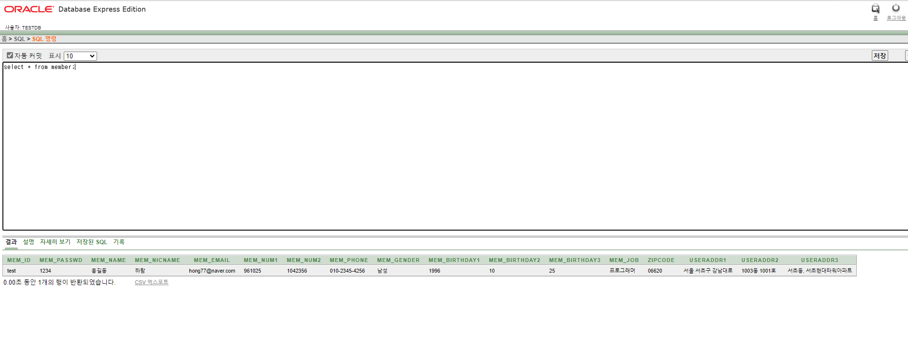

### 회원 가입 프로젝트  
  
- 아이디 중복 체크  
- 주민 번호 정상 유무 체크   
- 우편번호 찾기 ⇒ [중요] 다음 카카오 API 적용하여 처리  
- 오라클 DB 연동하여 회원 테이블에 insert 처리 (+오라클 설치)  
  
1. 프로젝트 디렉토리 구조  
프로젝트 명: Membership_Join  

	Java Resources 폴더    
		src 폴더에서  
			패키지 명: member 생성   
				클래스 명: DBBean ⇒ main() 메소드 포함X    
	WebContent 폴더에서  
		jsp 파일명: MemberForm 생성    
			    IdCheck  
			    Member_control  
			    Welcome  
		js 폴더 생성   
			javascript 파일명: idCheck  
   					change_email   
					juminCheck  
  
    
2. 오라클(Oracle) 설치  
OracleXEUniv.zip ⇒ 교수님께서 보내 줌   
파일 사용하여 설치를 진행  
 

=> 설치 확인  
  
C:\oraclexe\app\oracle\product\10.2.0\server\jdbc\lib 폴더에 접근  
⇒ ojdbc14.jar 파일  

  
이클립스에서 생성한 프로젝트 WebContent → WEB-INF → lib 아래에 ojdbc.jar 파일 붙여넣기  



3. DB 접속 후 계정 생성  
sysdba 관리자 계정으로 접속 후  
- 계정 생성(암호 포함)
- 생성된 계정에 권한 부여 ⇒ connect. resource 를 (Role) 권한 부여
- 생성된 계정으로 DB에 접속
- 회원 테이블 생성
- 데이터 입력 ⇒ 아이디 중복 체크를 하기 위해서 한 건의 데이터 입력이 필요하다.
- commit; ⇒ 반드시 commit한다.
- select 확인

SQL> conn /as sysdba  
SQL> create user testdb identified by testdb1234;  
SQL> grant connect, resource to testdb;  
SQL> conn testdb/testdb1234  
  
   


4. 회원(member) 테이블 생성, 회원 한명 입력, 조회
   
```
create table member(
mem_id varchar2(20) not null primary key,
mem_passwd varchar2(20) not null,
mem_name varchar2(20) not null,
mem_nicname varchar2(20),
mem_email varchar2(30) not null,
mem_num1 char(6) not null,
mem_num2 char(7) not null,
mem_phone char(13) not null,
mem_gender varchar2(10),
mem_Birthday1 number(4) not null,
mem_Birthday2 number(2) not null,
mem_Birthday3 number(2) not null,
mem_job varchar2(30) not null,
zipCode char(5) not null,
userAddr1 varchar2(60) not null,
userAddr2 varchar2(50),
userAddr3 varchar2(60) not null
);

   
insert into member values('test','1234','홍길동','하람','hong77@naver.com','961025','1042356','010-2345-4256','남성',1996,10,25,'프로그래머','06620','서울 서초구 강남대로','1003동 1001호','서초동, 서초현대타워아파트');

select * from member;

```   

- - - - - - - - - - - - - - - - - - - - - - - - - - - - - - - - - - - - - - - - - - - - - - - - - - - -    
   
**[참고] 아펙스(Apex) 란?**  
  
⇒ Application Express의 약자로 Oracle XE에서는 기본적으로 Apex를 제공한다.  
Web 상에서 DB를 컨트롤 할 수 있는 웹 애플리케이션을 말한다.  
  
- Apex port 번호 변경하기  
⇒ SQL 명령줄 실행 창에서  
SQL> conn /as sysdba  
SQL> exec dbms_xdb.setHTTPPort(9000); 

  
  
  
- 웹 브라우저에서 접속  
http://localhost:9000/apex  


- 사용자 testdb/ testdb1234 계정으로 로그인


- SQL명령→ 명령 입력 선택→ 테이블 생성, 데이터 입력, select 하기



조회
  
- - - - - - - - - - - - - - - - - - - - - - - - - - - - - - - - - - - - - - - - - - - - - - - - - - - -   

코드 START

**DBBean.java**

```java
import java.sql.Connection;
import java.sql.DriverManager;
import java.sql.PreparedStatement;
import java.sql.ResultSet;

public class DBBean {
	//멤버 변수(프로퍼티, 중간 저장소) 선언
	private String mem_id;
	private String mem_passwd;
	private String mem_name;
	private String mem_nickname;
	private String mem_email_id; //이메일 아이디
	private String mem_email_domain; //이메일 도메인
	private String mem_num1; //주민번호 앞자리
	private String mem_num2; //주민번호 뒷자리
	private String mem_phone;
	private String mem_gender;
	private int mem_Birthday1;	//출생년도
	private int mem_Birthday2; 	//출생월
	private int mem_Birthday3; //출생일
	private String mem_job;
	private String zipCode;  //우편번호
	private String userAddr1;  //주소
	private String userAddr2;  //상세주소
	private String userAddr3;  //주소 참고항목
	
	//오라클 DB 연동에 관련된 변수 선언
	Connection conn = null;
	PreparedStatement pstmt = null;
	ResultSet rs = null;
	
	//오라클 JDBC 연동을 위한 Driver, url 설정
	String jdbc_driver= "oracle.jdbc.driver.OracleDriver";
	String jdbc_url= "jdbc:oracle:thin:@localhost:1521:xe";
	
	//DB 연동 메소드 구현
	public void connect() {
		try {
			Class.forName(jdbc_driver);
			conn= DriverManager.getConnection(jdbc_url, "testdb","testdb1234");
				
		} catch (Exception e) {
			System.out.println(e);
		}
	}
	
	//DB 연동 종료 메소드 구현
	public void disconnect() {
		try {
			pstmt.close();
			conn.close();
			rs.close();
			
		} catch (Exception e) {
			System.out.println(e);
		}
	}
	
	public int confirmId(String mem_id) {
		connect();
		int idDuplication=0; //id 중복 여부 체크 변수
		try {
			String Confirmed_SELECT= "select mem_id from member where mem_id=?";
			
			pstmt = conn.prepareStatement(Confirmed_SELECT);
			pstmt.setString(1,  mem_id);
			rs = pstmt.executeQuery();
			
			if(rs.next()) {
				idDuplication = 1; //ID값이 중복인 경우
			}else {
				idDuplication = 0; //사용가능한 ID인 경우
			}
		} catch (Exception e) {
			// TODO: handle exception
			System.out.println("confirmed(): "+e);
		}finally {
			disconnect(); //자원 해제
		}
		
		return idDuplication;
		
	}
	
	//회원가입 폼에서 입력한 데이터들을 member 테이블에 저장하는 메소드 구현
	public boolean insertDB() {
		connect();
		int result = 0;
		
		try {
			String MEMBER_INSERT= "insert into member values(?,?,?,?,?,?,?,?,?,?,?,?,?,?,?,?,?)";
			
			pstmt = conn.prepareStatement(MEMBER_INSERT);
			
			String mem_email = mem_email_id+"@"+mem_email_domain;
			pstmt.setString(1, mem_id);
			pstmt.setString(2, mem_passwd);
			pstmt.setString(3, mem_name);
			pstmt.setString(4, mem_nickname);
			pstmt.setString(5, mem_email);
			pstmt.setString(6, mem_num1);
			pstmt.setString(7, mem_num2);
			pstmt.setString(8, mem_phone);
			pstmt.setString(9, mem_gender);
			pstmt.setInt(10, mem_Birthday1);
			pstmt.setInt(11, mem_Birthday2);
			pstmt.setInt(12, mem_Birthday3);
			pstmt.setString(13, mem_job);
			pstmt.setString(14, zipCode);
			pstmt.setString(15, userAddr1);
			pstmt.setString(16, userAddr2);
			pstmt.setString(17, userAddr3);
			
			result= pstmt.executeUpdate();
			
		} catch (Exception e) {
			System.out.println("insertDB(): "+e);
		}finally {
			disconnect(); //자원해제
		}
		
		return result>0?true:false;
	}
	
	//멤버 변수마다 getter, setter 메소드
	public String getMem_id() {
		return mem_id;
	}
	public void setMem_id(String mem_id) {
		this.mem_id = mem_id;
	}
	public String getMem_passwd() {
		return mem_passwd;
	}
	public void setMem_passwd(String mem_passwd) {
		this.mem_passwd = mem_passwd;
	}
	public String getMem_name() {
		return mem_name;
	}
	public void setMem_name(String mem_name) {
		this.mem_name = mem_name;
	}
	public String getMem_nickname() {
		return mem_nickname;
	}
	public void setMem_nickname(String mem_nickname) {
		this.mem_nickname = mem_nickname;
	}
	public String getMem_email_id() {
		return mem_email_id;
	}
	public void setMem_email_id(String mem_email_id) {
		this.mem_email_id = mem_email_id;
	}
	public String getMem_email_domain() {
		return mem_email_domain;
	}
	public void setMem_email_domain(String mem_email_domain) {
		this.mem_email_domain = mem_email_domain;
	}
	public String getMem_num1() {
		return mem_num1;
	}
	public void setMem_num1(String mem_num1) {
		this.mem_num1 = mem_num1;
	}
	public String getMem_num2() {
		return mem_num2;
	}
	public void setMem_num2(String mem_num2) {
		this.mem_num2 = mem_num2;
	}
	public String getMem_phone() {
		return mem_phone;
	}
	public void setMem_phone(String mem_phone) {
		this.mem_phone = mem_phone;
	}
	public String getMem_gender() {
		return mem_gender;
	}
	public void setMem_gender(String mem_gender) {
		this.mem_gender = mem_gender;
	}
	public int getMem_Birthday1() {
		return mem_Birthday1;
	}
	public void setMem_Birthday1(int mem_Birthday1) {
		this.mem_Birthday1 = mem_Birthday1;
	}
	public int getMem_Birthday2() {
		return mem_Birthday2;
	}
	public void setMem_Birthday2(int mem_Birthday2) {
		this.mem_Birthday2 = mem_Birthday2;
	}
	public int getMem_Birthday3() {
		return mem_Birthday3;
	}
	public void setMem_Birthday3(int mem_Birthday3) {
		this.mem_Birthday3 = mem_Birthday3;
	}
	public String getMem_job() {
		return mem_job;
	}
	public void setMem_job(String mem_job) {
		this.mem_job = mem_job;
	}
	public String getZipCode() {
		return zipCode;
	}
	public void setZipCode(String zipCode) {
		this.zipCode = zipCode;
	}
	public String getUserAddr1() {
		return userAddr1;
	}
	public void setUserAddr1(String userAddr1) {
		this.userAddr1 = userAddr1;
	}
	public String getUserAddr2() {
		return userAddr2;
	}
	public void setUserAddr2(String userAddr2) {
		this.userAddr2 = userAddr2;
	}
	public String getUserAddr3() {
		return userAddr3;
	}
	public void setUserAddr3(String userAddr3) {
		this.userAddr3 = userAddr3;
	}
	
	
	
}
```

**MemberForm.java**

⇒ 회원 가입 폼 완성하기

```java
<%@ page language="java" contentType="text/html; charset=UTF-8"
    pageEncoding="UTF-8"%>
<!DOCTYPE html>
<html>
<head>
<meta charset="UTF-8">
<title>회원가입 입력 폼</title>
<style type="text/css">
	.title { margin: 40px 30px 30px 30px; }
	.container { width: 900px; }
	.right { float:right; }
	.red { color: red; }
	tbody.tbody>tr { display: table; width: 900px; }
	tbody.tbody>tr>td:nth-child(1) { width:16%; vertical-align:middle;
									display: table-cell; text-align:center; }
	tbody.tbody>tr>td:nth-child(2) { width: 100%; }
	#detailAddress::placeholder { color: blue; }
</style>
</head>
<body>
	<form name="memberForm" method="POST" action="Member_control.jsp">
		<input type="hidden" name="action" value="insert"/>
		<div align="center">
			<h1 class="title">회원가입</h1>
			<div class="container">
				<div class="right"><span class="red">*</span>필수입력사항</div>
				<table border="2">
					<thead>
						<tr>
							<th colspan="2" border="0" bgcolor="orange">회원 기본 정보</th>
						</tr>
					</thead>
					<tbody class="tbody">
						<tr>
							<td>아이디<span class="red">*</span></td>
							<td>
								<input type="text" name="mem_id" placeholder="6자 이상의 영문자와 숫자" required autofocus/>
								<input type="button" value="ID중복확인" onclick="idCheck(mem_id.value)"/>
							</td>
						</tr>
						<tr>
							<td>비밀번호<span class="red">*</span></td>
							<td>
								<input type="password" name="mem_passwd" maxlength="12" minlength="8" required/>
								<span>8~12자리의 영문 대문자와 숫자, 특수문자만 입력</span>
							</td>
						</tr>
						<tr>
							<td>이름<span class="red">*</span></td>
							<td>
								<input type="text" name="mem_name"  required/>
							</td>
						</tr>
						<tr>
							<td>닉네임</td>
							<td>
								<input type="text" name="mem_nickname" maxlength="12" minlength="2"/>
								<span>2~8자리의 한글로만 입력</span>
							</td>
						</tr>
						<tr>
							<td>이메일<span class="red">*</span></td>
							<td>
								<input type="text" name="mem_email_id" id="email_id"/>@
								<input type="text" name="mem_email_domain" id="email_add"/>
								<select name="email_sel" id="email_sel" style="font-size:16px; height: 30px;" onchange="change_email();">
									<option value="">직접입력</option>
									<option value="naver.com">naver.com</option>
									<option value="hanmail.net">hanmail.net</option>
									<option value="gmail.com">gmail.com</option>
									<option value="nate.com">nate.com</option>
									<option value="kakao.com">kakao.com</option>
									<option value="korea.com">korea.com</option>
									<option value="dreamwiz.com">dreamwiz.com</option>
									<option value="icloud.com">icloud.com</option>
								</select>
							</td>
						</tr>
						<tr>
							<td>주민번호<span class="red">*</span></td>
							<td>
								<input type="text" name="mem_num1" maxlength="6" onkeyup="if(this.value.length==6) memberForm.mem_num2.focus();"/>
								<input type="text" name="mem_num2" maxlength="7"/>
								<input type="button" value="주민번호 정상 유무 체크" onclick="juminCheck(mem_num1.value, mem_num2.value)"/>
							</td>
						</tr>
						<tr>
							<td>핸드폰번호<span class="red">*</span></td>
							<td>
								<input type="tel" name="mem_phone" pattern="(010)-[0-9]{4}-[0-9]{4}" required/>
								(예)010-1234-5678
							</td>
						</tr>
						<tr>
							<td>성별</td>
							<td>
								<input type="radio" name="mem_gender" value="남성" checked/>남성&nbsp;&nbsp;&nbsp;
								<input type="radio" name="mem_gender" value="여성"/>여성
							</td>
						</tr>
						<tr>
							<td>생년월일<span class="red">*</span></td>
							<td>
								<script>
									var today = new Date();
									var toyear = parseInt(today.getFullYear()); //2021년을 얻어옴!
									var start = toyear - 15; //네이버인 경우 만 14세 이상 회원가입 가능!!
									var end = toyear - 80;
									
									//연도
									document.write("<select name='mem_Birthday1'>")
									for(i=start;i>=end;i--){
										document.write("<option value='"+i+"'>"+i+"</option>")
									}
									document.write("</select>년")
									
									//월
									document.write("<select name='mem_Birthday2'>")
									for(i=1;i<=12;i++){
										document.write("<option value='"+i+"'>"+i+"</option>")
									}
									document.write("</select>월")
									
									//일
									document.write("<select name='mem_Birthday3'>")
									for(i=1;i<=31;i++){
										document.write("<option value='"+i+"'>"+i+"</option>")
									}
									document.write("</select>일")
								</script>
							</td>
						</tr>
						<tr>
							<td>주소<span class="red">*</span></td>
							<td>
								<div class="inputArea">
									<p>
										<input type="text" name="zipCode" id="postcode" placeholder="우편번호" />
										<input type="button" onclick="execDaumPostcode()" value="우편번호 찾기" />
									</p>
									<p>
										<input type="text" name="userAddr1" id="address" size="100" placeholder="주소"/>
										<input type="text" name="userAddr3" id="extraAddress" size="48" placeholder="참고항목(도로명인 경우: 지역이름과 아파트 이름)"/>
										<input type="text" name="userAddr2" id="detailAddress" size="45" placeholder="상세주소(아파트 동호수 또는 빌딩이름 입력하세요!)"/>
									</p>
								</div>
							</td>
						</tr>
					</tbody>
				</table>
			</div>
		</div>
	</form>
</body>
</html>
```

주소 기능 구현

- 다음 카카오 우편번호 서비스 링크

[Daum 우편번호 서비스](https://postcode.map.daum.net/guide)

```java
<div class="inputArea">
									...
									...
									<div id="layer" style="display:none;position:fixed;overflow:hidden;z-index:1;-webkit-overflow-scrolling:touch;">
										
									</div>
									<script src="http://dmaps.daum.net/map_js_init/postcode.v2.js"></script>
									<script>
									    // 우편번호 찾기 화면을 넣을 element
									    var element_layer = document.getElementById('layer');
									
									    function closeDaumPostcode() {
									        // iframe을 넣은 element를 안보이게 한다.
									        element_layer.style.display = 'none';
									    }
									
									    function execDaumPostcode() {
									        new daum.Postcode({
									            oncomplete: function(data) {
									                // 검색결과 항목을 클릭했을때 실행할 코드를 작성하는 부분.
									
									                // 각 주소의 노출 규칙에 따라 주소를 조합한다.
									                // 내려오는 변수가 값이 없는 경우엔 공백('')값을 가지므로, 이를 참고하여 분기 한다.
									                var addr = ''; // 주소 변수
									                var extraAddr = ''; // 참고항목 변수
									
									                //사용자가 선택한 주소 타입에 따라 해당 주소 값을 가져온다.
									                if (data.userSelectedType === 'R') { // 사용자가 도로명 주소를 선택했을 경우
									                    addr = data.roadAddress;
									                } else { // 사용자가 지번 주소를 선택했을 경우(J)
									                    addr = data.jibunAddress;
									                }
									
									                // 사용자가 선택한 주소가 도로명 타입일때 참고항목을 조합한다.
									                if(data.userSelectedType === 'R'){
									                    // 법정동명이 있을 경우 추가한다. (법정리는 제외)
									                    // 법정동의 경우 마지막 문자가 "동/로/가"로 끝난다.
									                    if(data.bname !== '' && /[동|로|가]$/g.test(data.bname)){
									                        extraAddr += data.bname;
									                    }
									                    // 건물명이 있고, 공동주택일 경우 추가한다.
									                    if(data.buildingName !== '' && data.apartment === 'Y'){
									                        extraAddr += (extraAddr !== '' ? ', ' + data.buildingName : data.buildingName);
									                    }
									                    // 표시할 참고항목이 있을 경우, 괄호까지 추가한 최종 문자열을 만든다.
									                    if(extraAddr !== ''){
									                        extraAddr = ' (' + extraAddr + ')';
									                    }
									                    // 조합된 참고항목을 해당 필드에 넣는다.
									                    document.getElementById("extraAddress").value = extraAddr;
									                
									                } else {
									                    document.getElementById("extraAddress").value = '';
									                }
									
									                // 우편번호와 주소 정보를 해당 필드에 넣는다.
									                document.getElementById('postcode').value = data.zonecode;
									                document.getElementById("address").value = addr;
									                // 커서를 상세주소 필드로 이동한다.
									                document.getElementById("detailAddress").focus();
									
									                // iframe을 넣은 element를 안보이게 한다.
									                // (autoClose:false 기능을 이용한다면, 아래 코드를 제거해야 화면에서 사라지지 않는다.)
									                element_layer.style.display = 'none';
									            },
									            width : '100%',
									            height : '100%',
									            maxSuggestItems : 5
									        }).embed(element_layer);
									
									        // iframe을 넣은 element를 보이게 한다.
									        element_layer.style.display = 'block';
									
									        // iframe을 넣은 element의 위치를 화면의 가운데로 이동시킨다.
									        initLayerPosition();
									    }
									
									    // 브라우저의 크기 변경에 따라 레이어를 가운데로 이동시키고자 하실때에는
									    // resize이벤트나, orientationchange이벤트를 이용하여 값이 변경될때마다 아래 함수를 실행 시켜 주시거나,
									    // 직접 element_layer의 top,left값을 수정해 주시면 됩니다.
									    function initLayerPosition(){
									        var width = 500; //우편번호서비스가 들어갈 element의 width
									        var height = 600; //우편번호서비스가 들어갈 element의 height
									        var borderWidth = 5; //샘플에서 사용하는 border의 두께
									
									        // 위에서 선언한 값들을 실제 element에 넣는다.
									        element_layer.style.width = width + 'px';
									        element_layer.style.height = height + 'px';
									        element_layer.style.border = borderWidth + 'px solid';
									        // 실행되는 순간의 화면 너비와 높이 값을 가져와서 중앙에 뜰 수 있도록 위치를 계산한다.
									        element_layer.style.left = (((window.innerWidth || document.documentElement.clientWidth) - width)/2 - borderWidth) + 'px';
									        element_layer.style.top = (((window.innerHeight || document.documentElement.clientHeight) - height)/2 - borderWidth) + 'px';
									    }
									</script>
</div>
```

주민 번호 체크 기능 구현

**juminCheck.js**

```java
/**
 * juminCheck.js 파일
 * 주민번호 체크 자바스크립트 파일
 */

function juminCheck(jumin1, jumin2){
	var juminNum = jumin1+jumin2;
	var jumin_pattern = new RegExp('^[0-9]{6}[1234][0-9]{6}');
	
	if(!jumin_pattern.test(juminNum)){
		alert('주민번호가 정규 표현식에 적합하지 않습니다.');
		return;
	}else{
		alert('주민번호가 정규 표현식 패턴에 적합합니다.');
		
		/*
		 * 주민번호 체크 공식 적용
		 */
		var sum= 0; //누계 변수는 0으로 초기화
	    var weight= [2,3,4,5,6,7,8,9,2,3,4,5]; //가중치 배열 초기화
	    var temp, result;
	    
		//1단계=> sum 구하기
        for(var i=0;i<12;i++) {
            var gop=(juminNum.charAt(i))* weight[i]; //0의 ASCII코드 값(48)을 빼줌
            sum+= gop;
        }
        
      //2단계 공식=> temp값이 두 자리인 주민번호를 가진 경우가 있다. 10 or 11
        temp= 11- (sum%11);

        //3단계 공식=> temp값이 두 자리인 주민번호인 경우를 대비해서 ... 한번 더!
        result= temp%10;
  
        //주민번호 정상 유무 체크=> return
        if(result==(juminNum.charAt(12))){ //주민번호가 정상일 때
            alert('주민번호 체크결과 정상입니다.');
        }else{
        	alert('주민번호가 정확하지 않습니다. 다시 확인하세요.')
        }
	}
	
}
```

++ jsp 폼 파일에 js파일 추가해주기

```java
<script src="./js/juminCheck.js" type="text/javascript"></script>
```
